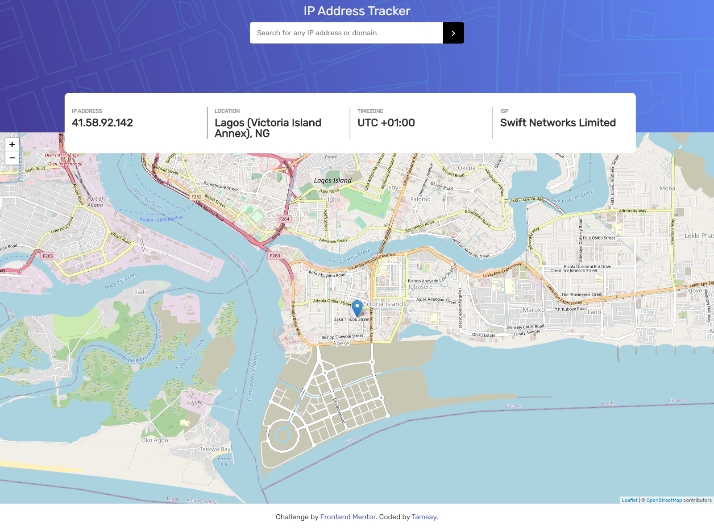
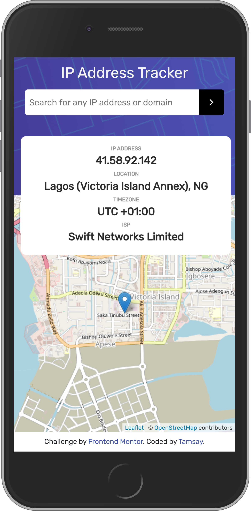

# IP Address Tracker

### Welcome! 👋

This App helps to display some key details about IP addresses. Users are able to do the following with the app:

- View the optimal layout for each page depending on their device's screen size
- See their own IP Address on the map on the initial page load
- Search for any IP addresses or domains and see the key information and location

I made use of [IP Geolocation API by IPify](https://geo.ipify.org/) to get the IP Address details while [LeafletJS](https://leafletjs.com/) was used to display the map.

The project was created using vanilla js, html, css and bootstrap. 

# Screenshots

## Live Demo

[Hosted Link](https://tamsay-ip-address-tracker.netlify.app)

## Author

Longe Temitope
- Github: [@tamsay](https://github.com/tamsay)
- Twitter: [@longetope](https://twitter.com/longetope)

## 🤝 Contributing

Contributions, issues and feature requests are welcome!

Feel free to check the [issues page](https://github.com/tamsay/ip_address_tracker/issues)

## Show your support

Give a ⭐️ if you like this project!

## Acknowledgments

Project inspired by [Frontend Mentor](https://www.frontendmentor.io/)

